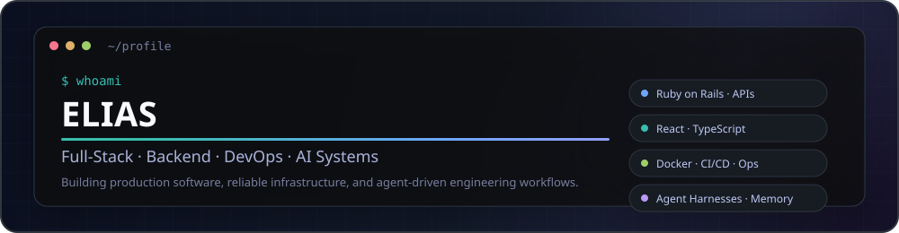
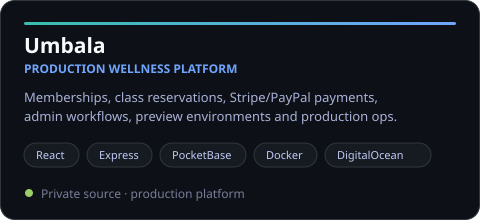
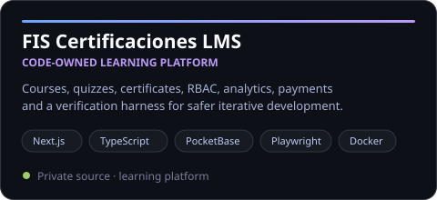
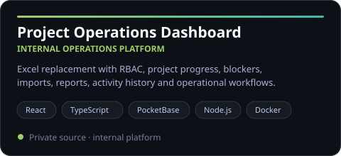
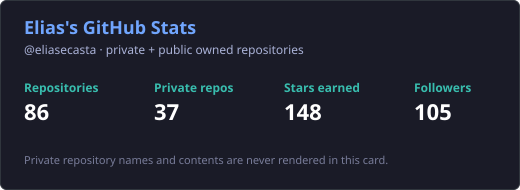
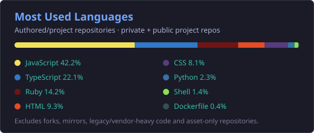

  

  
  

## About me

I'm an **IT Engineer and Full-Stack Developer from Mexico** 🇲🇽. I build production web applications, APIs, internal tools, and the infrastructure around them — from application architecture and databases to CI/CD, observability, deployments, backups, and recovery workflows.

I also work with **AI systems as an engineering discipline**: agent harnesses, workflow orchestration, context and memory systems, repository-level agent instructions, reusable skills, and automated verification loops that make software agents more reliable and token-efficient.

### 🧑‍💻 Engineering focus

- 💎 **Backend & APIs:** Ruby on Rails, Node.js, Express, REST APIs, background jobs
- ⚛️ **Frontend:** React, Next.js, TypeScript, JavaScript, Tailwind CSS, Framer Motion
- 🗄️ **Data:** PostgreSQL, MySQL, PocketBase, Redis, SQLite
- 🧪 **Quality:** RSpec, Jest/Vitest, Playwright/E2E, linting, typechecking, build gates
- ♾️ **DevOps & infrastructure:** Docker, Docker Compose, GitHub Actions, DigitalOcean, Nginx, Caddy, Linux, WSL, Vercel
- 🔐 **Secrets & operations:** Doppler, Bitwarden, environment isolation, backups, restore drills, rollback-oriented deployments
- 📡 **Observability:** Sentry, health checks, structured logging, deployment verification
- 🧠 **AI systems & developer tooling:** agent harnesses, orchestration, context/memory, `AGENTS.md` / `SKILL.md` workflows, automated verification loops, Codex, DeepSeek, GitHub Copilot

## 🚀 Featured work

  
  

  

Most of my current production work lives in private repositories. The cards above describe the architecture at a high level without exposing private source code.

## 🛠️ Core stack

### ⚙️ DevOps & platform

## 📊 GitHub activity

  
  

<picture>
  <source media="(prefers-color-scheme: dark)" srcset="./profile/contribution-snake-dark.svg" />
  <source media="(prefers-color-scheme: light)" srcset="./profile/contribution-snake.svg" />
  
</picture>

## 🎮 Outside of code

When I'm not building something, there's a good chance I'm playing videogames, experimenting with new tools, or finding another project to over-engineer.

## 📫 Get in touch

The best way to reach me is through [LinkedIn](https://www.linkedin.com/in/eliasecasta/).

---

<i>Always building. Always learning.</i>

